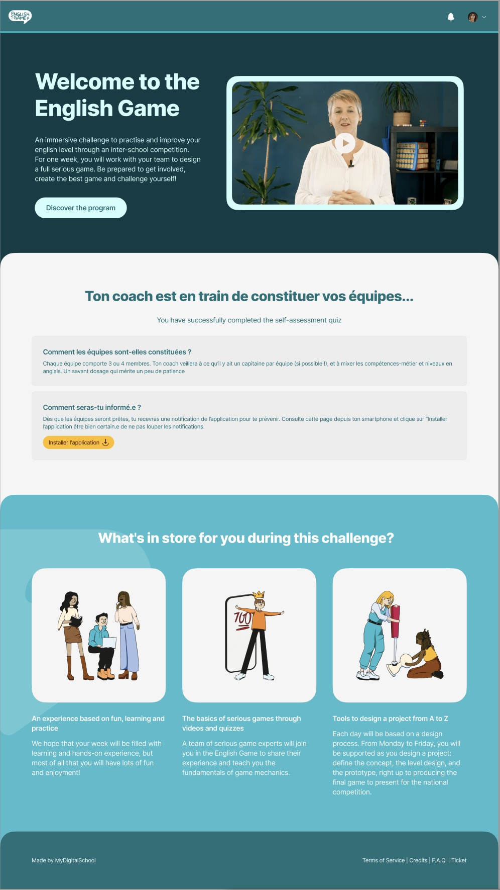

# Création d'une maquette English game à partir d'un modèle


## Introduction
Durant ce projet nous avons utilisé le language HTML et CSS. L'objectif est de reproduire la maquette ci-dessous :




 
## Installation et manipulation des commandes sous Linux

Afin de travailler sous linux, nous avons ajouté les peripheriques wsl sous windows et installé la distribution Ubuntu.
Une fois l'installation réalisée, nous avons manipulé quelques commandes afin de nous familiariser aevc le terminal. Ci-dessous les commandes utilisées :
- apt – get
- touch 
- mkdir 
- cd 
- ls
- pwd 
- cp
- rm

## Introduction à Git

Nous avons à partir du terminal wsl, creer un dossier de notre projet English game dans notre local et créer un dossier .git grâce à la commande : 
```bash
git init
```
Ce dossier est en mode caché dans notre projet, nous pouvons le retrouver à travers la commande : 
```bash
ls -a.
```

Afin d'ouvrir notre VS code à travers notre terminal et parametré le VS code sous Linux (avec une installation en plus WSL sous VS code); nous avons tapé la commande code "nom du projet" puis ajouté ces 2 config :
```bash
git config --global user.email "adresse@mail.com"
git config --global user.name "Sabrina"
```

## Origin

Github

## Decoupage du projet

Nous avons recupéré et enregistré les images dans un premier temps 

1. Page du haut
2. Page du milieu
3. Bas de page

## Conclusion 


